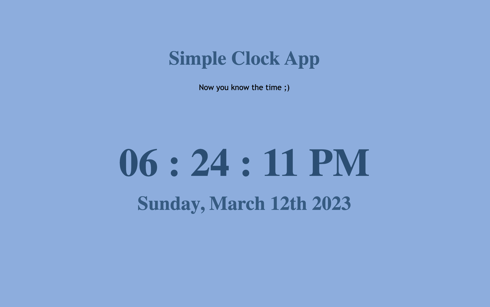

# Simple Clock App

This is a simple clock app showing the todays date, up the to the current second.
This prjects utilizes the new Date() object to get the current date and time.

# Description

To get the current date and month, the arrays are converted from zero based to standard. To do this new new arrays of months and days of the week are created and then passed in the current month and day of the week by getting it from the Date object.

To get the the clock to 'tick' and show the current second refresh on-screen each second, an interval is used to get seconds from new Date object every second.

Access my project [here] (https://kurtis-casperson.github.io/digital-clock-app/)

